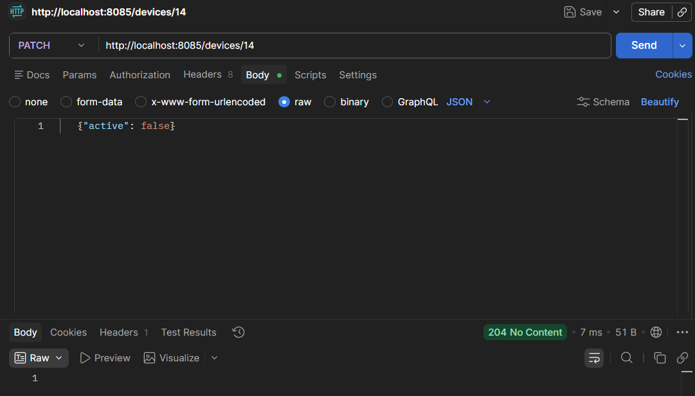
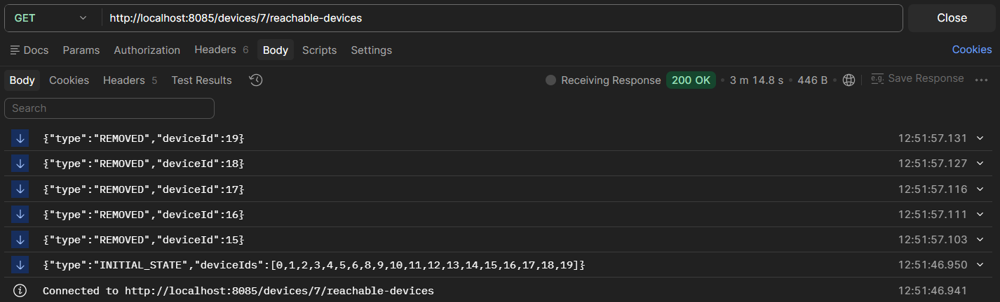
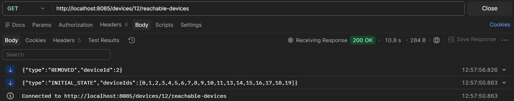
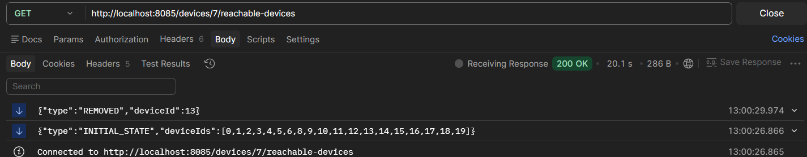
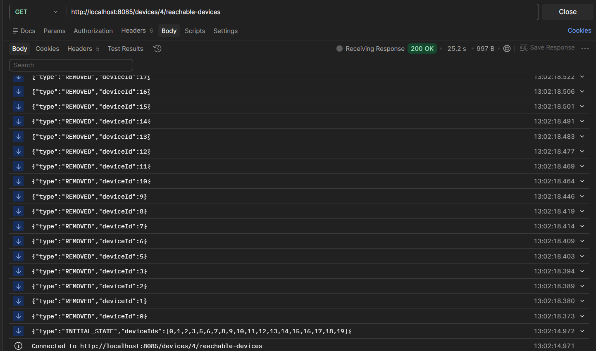
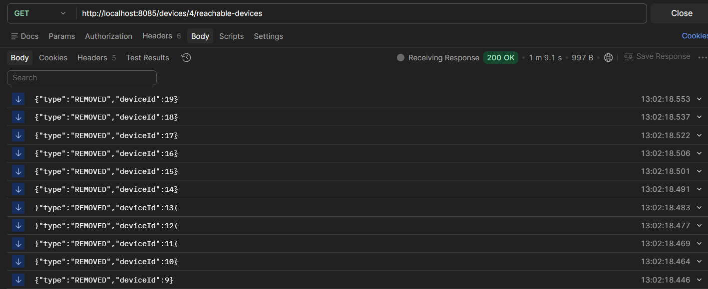

# Network Management System

A small web server (Kotlin + Ktor) that models a network of devices and streams
changes in reachability to subscribers using Server-Sent Events (SSE).

## Run

Requirements: JDK 21.

```
./gradlew run        # Windows: .\gradlew.bat run
```

The server starts on http://localhost:8085. The topology is read at startup from
`src/main/resources/topology.json`. Invalid data (duplicate ids, connections to
unknown devices) stops the server with an error message.

Tests: `./gradlew test`

## Endpoints

### `PATCH /devices/{id}`

Turns a device on or off.

```
PATCH /devices/15
Content-Type: application/json

{"active": false}
```

| Status | Meaning |
|---|---|
| 204 | Updated (no body) |
| 400 | `id` is not an integer, or the body is not valid |
| 404 | No such device |

### `GET /devices/{id}/reachable-devices`

An SSE stream. Content-Type is `text/event-stream`. The connection stays open and the
server pushes an event whenever the set of reachable devices changes.

## Event protocol

To save bandwidth the server never resends the whole set. It sends one snapshot
and then only deltas.

```
{"type":"INITIAL_STATE","deviceIds":[1,2,3]}   sent once, right after subscribing
{"type":"REMOVED","deviceId":2}                 device is no longer reachable
{"type":"ADDED","deviceId":2}                   device is reachable again
```

A client rebuilds the current set as: `INITIAL_STATE` minus every `REMOVED` plus
every `ADDED`. One event is sent per device. If a device and others behind it become
unreachable, each gets its own `REMOVED` event.

## How reachability is defined

A device is reachable from X if it is active and there is a path from X to it
that goes only through active devices. Connections are bidirectional. X itself is
never in its own set. Turning a device off therefore removes it and every device
that is cut off from X because of it, but not devices that still have another path.

## Design decisions

- **Per-subscriber recalculation.** On every change the server recomputes the
  reachable set from each subscriber's own start device and diffs it against what
  that subscriber already knows. The same PATCH can produce different events for
  different subscribers.
- **No effect, no events.** Setting a device to the state it already has sends nothing.
- **Inactive start device.** A device that is off reaches nothing, so its subscriber
  receives `REMOVED` for everything it could see. The stream stays open, and turning
  the device back on sends `ADDED` events.
- **Event order.** Events of one change are sorted by device id, `REMOVED` first.
- **Consistency.** Subscribing and changing a device run under one mutex, so a
  subscriber cannot miss a change between its snapshot and its registration.
- **Disconnects.** A subscriber is removed when the client disconnects.
- **State is in memory only.** Changes are lost on restart, as the assignment allows.
- **Known limitation.** For an unknown device id the SSE endpoint returns an empty
  stream instead of 404.

## Project structure

| File | Purpose |
|---|---|
| `Models.kt` | Data classes and event types |
| `TopologyLoader.kt` | Reads and validates `topology.json` |
| `NetworkGraph.kt` | Adjacency lists, active flags, reachability search |
| `NetworkService.kt` | Subscribers, locking, delta calculation |
| `Routing.kt` | The two endpoints |


## Demonstration

Each scenario was run on a freshly started server (state is in memory only),
so every run started from the original topology. In Postman, new events appear at the
top of the response panel, so the `INITIAL_STATE` event is at the bottom.

**PATCH request used to turn a device off**



### 1. Subscribe to Lublin, turn off Kielce

Expected: `REMOVED` for 15, 16, 17, 18, 19. Devices 16-19 are still active, but
Kielce was their only connection to the rest of the network.



### 2. Subscribe to Radom, turn off Wroclaw

Expected: only `REMOVED` for 2. Radom is also connected to Szczecin, so every
other device stays reachable.



### 3. Subscribe to Lublin, turn off Torun

Expected: only `REMOVED` for 13. Torun is a dead end.



### 4. Subscribe to Gdansk, turn off Sosnowiec

Expected: `REMOVED` for all 19 other devices. Gdansk is connected only to
Sosnowiec, so nothing is reachable any more.


