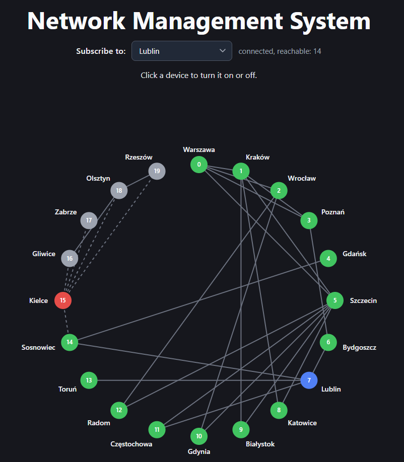

# Network Management System: Web UI

An optional React UI for the Network Management System backend. It draws the
network, subscribes to the reachable-devices stream of a chosen device, and lets
you turn devices on and off.



## Requirements

- Node.js (current LTS)
- The backend running on http://localhost:8085 (see the main README)

## Run

```
cd frontend
npm install
npm run dev
```

Open the address printed by Vite, usually http://localhost:5173.

## How to use

1. Pick a city in **Subscribe to**. The UI opens an SSE stream for that device.
2. Click any device in the graph to turn it on or off.

| Colour | Meaning |
|---|---|
| Blue | the device you are subscribed to |
| Green | reachable from the subscribed device |
| Grey | active, but not reachable (cut off, or no subscription) |
| Red | switched off |

A dashed line is a connection to a switched-off device.

Example: subscribe to Lublin and turn off Kielce. Kielce turns red, and Gliwice,
Zabrze, Olsztyn and Rzeszow turn grey: they are still on, but Kielce was their
only link to the rest of the network.

## How it works

The UI does no graph calculations. The backend does them and the UI only shows
the result.

| Backend endpoint | Used for |
|---|---|
| `GET /topology` | devices (with their current `active` flag) and connections, loaded once |
| `GET /devices/{id}/reachable-devices` | SSE stream, opened with the browser's `EventSource` |
| `PATCH /devices/{id}` | turning a device on or off |

`GET /topology` is not part of the assignment. It was added only so the UI knows
which devices and connections exist.

The set of reachable devices is rebuilt from the event stream:

- `INITIAL_STATE` replaces the whole set,
- `ADDED` adds one device,
- `REMOVED` removes one device.

`PATCH` returns no list. Its effect arrives through the already open stream, so
the graph is recoloured when the events arrive. If the connection drops,
`EventSource` reconnects by itself and the server sends a fresh `INITIAL_STATE`,
which replaces the set, so the view repairs itself.

## Project layout

| File | Purpose |
|---|---|
| `src/types.ts` | types mirroring the backend models and events |
| `src/api.ts` | `fetchTopology` and `setActive` |
| `src/useReachable.ts` | hook: opens the SSE stream and applies events to a set |
| `src/NetworkView.tsx` | draws the graph as SVG, nodes placed on a circle |
| `src/App.tsx` | holds the state and connects the pieces |
| `vite.config.ts` | dev proxy to the backend |

## Dev proxy

The page runs on port 5173 and the backend on 8085. To avoid CORS, `vite.config.ts`
forwards `/devices` and `/topology` to http://localhost:8085. If the backend uses
another port, change it there.

## Known limitations

- The red "switched off" state comes from `GET /topology` and from clicks in this
  UI. If a device is switched off from another client (for example Postman), the
  reachability colours update, but the red colour appears only after a page reload.
  The backend streams reachability changes, not flag changes, as the assignment
  requires.
- Nodes are placed on a circle, so many connections cross the middle.